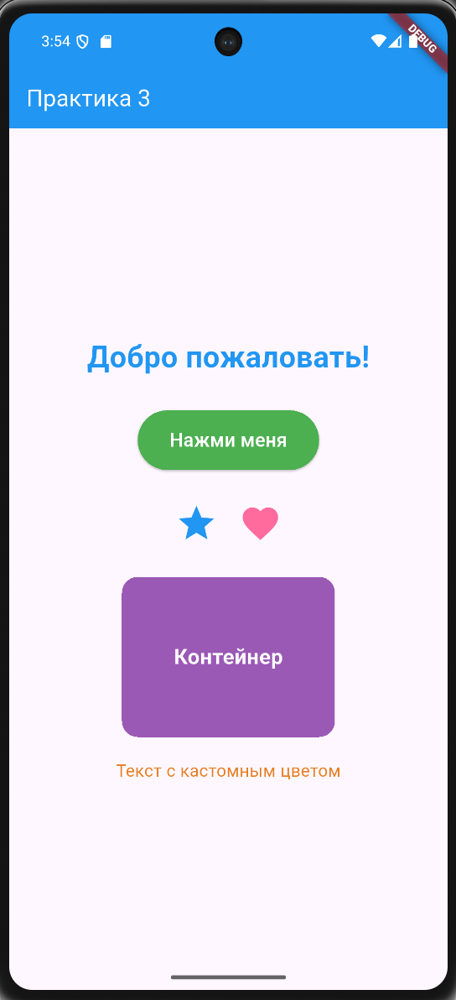

# Красавин Л.В ЭФБО-10-23 ПЗ-3

## Использованные виджеты

В приложении были использованы следующие виджеты Flutter:

1. **MaterialApp** — корневой виджет приложения, обеспечивающий Material Design тему
2. **Scaffold** — базовый каркас экрана с AppBar и body
3. **AppBar** — верхняя панель приложения с заголовком "Практика 3"
4. **Column** — вертикальная компоновка элементов
5. **Row** — горизонтальная компоновка иконок
6. **Text** — виджет для отображения текста (использован для приветствия и других текстовых элементов)
7. **ElevatedButton** — кнопка с возвышенным эффектом
8. **Container** — контейнер с заданными размерами и стилями
9. **Icon** — иконки (звезда и сердце)
10. **SizedBox** — виджет для создания отступов между элементами
11. **BoxDecoration** — декорация для контейнера с цветом и скруглёнными углами
12. **Center** — центрирование содержимого контейнера

## Возникшие трудности

Трудностей в процессе выполнения не было.

