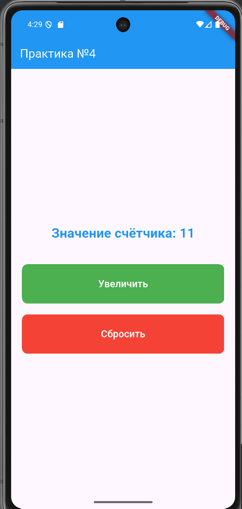
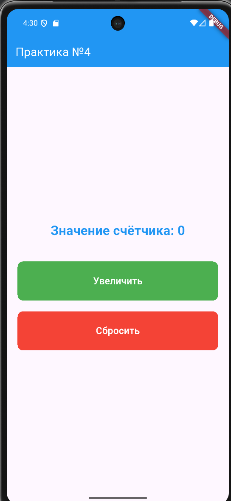

# Красавин Л.В ЭФБО-10-23 ПЗ-4

Скриншот при значении счётчика > 10.
 
Скриншот после сброса.

## Краткий отчёт

### Какие виджеты использовались

Использовал StatefulWidget для работы с состоянием, Column для размещения элементов, Container с разными цветами для обёртки кнопок, ElevatedButton для кнопок и Text для отображения счётчика. Также применял Padding и SizedBox для отступов.

### Как реализовано обновление состояния

Создал StatefulWidget с переменной counter. При изменении значения вызываю setState(), чтобы интерфейс обновился. Есть три метода: один увеличивает счётчик на 1, второй на 10, третий сбрасывает в ноль.

### Какие события обрабатывались

Обрабатывал обычное нажатие (onPressed) — увеличивает на 1 или сбрасывает счётчик, и долгое нажатие (onLongPress) на кнопку "Увеличить" — увеличивает сразу на 10.